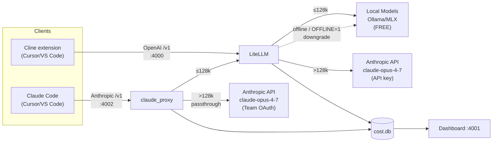

# MacM4LocalAgent

Hybrid local + Claude coding setup for Apple Silicon (M3 Max or newer,
64-128 GB RAM). Runs **Qwen3-Coder-Next** locally via Ollama, plus a small
MLX server for fast short-context turns, and falls back to **Claude
Opus 4.7** when a prompt is too big or too complex for local. Works with
**Cline** and **Claude Code** — routes small tasks to free local models,
escalates large tasks to Anthropic with configurable billing.


## At a glance



> **Airplane / no-network?** The router auto-detects when
> `api.anthropic.com:443` is unreachable and silently rewrites every
> Claude selection to `local-long`. Force it permanently with
> `make offline` (no proxy restart needed). Details:
> [docs/offline-mode.md](docs/offline-mode.md).

> **Why Cline + Claude Code, not Cursor's native Agent?** Cursor's native agent routes requests
> through `api2.cursor.sh` (blocks loopback + RFC 1918 + CGNAT) and doesn't
> pass tool-call deltas through. Cline and Claude Code run in the local extension host and
> call `127.0.0.1:4000` / `:4002` directly. Details:
> [docs/RUNBOOK-cline-setup.md](docs/RUNBOOK-cline-setup.md) and
> [docs/CLAUDE-CODE-INTEGRATION.md](docs/CLAUDE-CODE-INTEGRATION.md).

---

## Quickstart (15–60 minutes depending on download speed)

```bash
# 1. Clone
git clone https://github.com/martinfr-certifyos/MacM4LocalAgent.git ~/MacM4LocalAgent
cd ~/MacM4LocalAgent

# 2. Get an Anthropic API key (only needed for the claude-* tiers)
#    https://console.anthropic.com/settings/keys -> "Create Key"
echo 'export ANTHROPIC_API_KEY="sk-ant-..."' >> ~/.zshrc
source ~/.zshrc
launchctl setenv ANTHROPIC_API_KEY "$ANTHROPIC_API_KEY"   # so the daemon sees it too

# 3. Detect hardware
make detect

# 4. Install everything (~45 GB of downloads in the background)
make install

# 5. Load all services into launchd
make start

# 6. Wait for downloads to finish, then health-check
make downloads-watch    # Ctrl-C once both show DONE
make verify

# 7. Install the Cline extension (auto-detects Cursor or VS Code)
make cline
# Quit and relaunch the IDE.
```

Then jump to [Wire Cline to the proxy](#wire-cline-to-the-proxy) below.

> **Note:** none of `make install`, `make start`, `make verify`, or
> `make downloads-watch` install the Cline extension for you. Cline is an
> IDE extension that lives in your IDE's profile, not in this repo's venv.
> `make cline` is the dedicated target — see step 7 below for what it does
> and the manual fallback paths.

---

## Prerequisites checklist

| What                       | Why                                                        | How to install / verify                                                                          |
| -------------------------- | ---------------------------------------------------------- | ------------------------------------------------------------------------------------------------ |
| Apple Silicon, 64+ GB RAM  | Qwen3-Coder-Next q4 needs ~45 GB resident at 64 k context  | `system_profiler SPHardwareDataType \| grep -E "Chip\|Memory"`                                   |
| ~100 GB free disk          | model downloads (~45 GB Ollama + ~5 GB MLX + headroom)     | `df -h /`                                                                                        |
| macOS 14 (Sonoma) or newer | required for current Metal / MLX builds                    | `sw_vers`                                                                                        |
| Xcode Command Line Tools   | needed by Homebrew, Python build, git                      | `xcode-select --install`                                                                         |
| Homebrew                   | installs `ollama`, `jq`, `openssl`                         | `/bin/bash -c "$(curl -fsSL https://raw.githubusercontent.com/Homebrew/install/HEAD/install.sh)"` |
| Python 3.11 or newer       | LiteLLM, dashboard, router                                 | `brew install python@3.12`                                                                       |
| `uv`                       | venv manager used by the Makefile                          | `brew install uv`                                                                                |
| Cursor IDE                 | host for the Cline extension (Cursor is a VSCode fork)     | <https://cursor.com> — install to `/Applications/Cursor.app`                                     |
| Anthropic API key          | needed for the `claude-*` tiers; local tiers work without  | <https://console.anthropic.com/settings/keys>                                                    |

---

## Step-by-step

### 1. Clone the repo

```bash
git clone https://github.com/martinfr-certifyos/MacM4LocalAgent.git ~/MacM4LocalAgent
cd ~/MacM4LocalAgent
```

Everything below assumes your shell is in `~/MacM4LocalAgent`.

### 2. Anthropic API key (optional but recommended)

Without this key, the **local tiers still work**. You only lose the
`claude-*` tiers (Opus / Sonnet / Haiku), so the router will not have a
quality escalation path when a prompt truly needs it.

1. Create a key: <https://console.anthropic.com/settings/keys> → "Create
   Key". Copy the `sk-ant-…` string.
2. Persist it to your shell rc so future shells have it:

   ```bash
   echo 'export ANTHROPIC_API_KEY="sk-ant-..."' >> ~/.zshrc
   source ~/.zshrc
   ```

3. Make it available to launchd (so the LiteLLM proxy daemon can read it):

   ```bash
   launchctl setenv ANTHROPIC_API_KEY "$ANTHROPIC_API_KEY"
   ```

   **Caveat:** `launchctl setenv` doesn't survive reboot. After a reboot,
   re-run that one command before the proxy can call Claude. If you want
   it to survive reboot too, create a tiny boot-time agent — see
   [docs/operations.md](docs/operations.md).

The proxy expects this exact variable name (`ANTHROPIC_API_KEY`); the
`claude-*` model entries in `config/litellm-config.yaml` reference it as
`os.environ/ANTHROPIC_API_KEY`.

### 3. Hardware detection

```bash
make detect
```

This writes `config/detected.env` with what the rest of the install
depends on:

- `OLLAMA_TAG` — which Qwen3-Coder-Next GGUF to pull (e.g.
  `qwen3-coder-next:q4_K_M` on a 64-128 GB M-series).
- `KV_CACHE_TYPE` — the strongest KV-cache compression your installed
  Ollama supports (today: `q4_0`, ~4×). See
  [docs/turboquant.md](docs/turboquant.md) for what this becomes when
  upstream lands `tq3`.
- `LOCAL_LONG_CTX` — usable context ceiling for the Ollama tier
  (today: 65 536 = 64 k).
- Ports for LiteLLM (`4000`), MLX (`8081`), Ollama (`11434`), dashboard
  (`4001`).

You should see something like:

```
[detect] Hardware:   Apple M5 Max, 128GB RAM, 40-core GPU, 1653GB free
[detect] Quant tier: q4 (qwen3-coder-next:q4_K_M)
[detect] KV cache:   q4_0 (standard Q4_0 block quant (~4x, stable))
[detect] Contexts:   fast=16384, long=65536
[detect] Wrote /…/config/detected.env
```

### 4. Install + render configs

```bash
make install
```

What this does, in order:

1. `scripts/10-brew.sh` — ensures Homebrew + `ollama`, `jq`, `openssl`,
   `uv` are present.
2. `scripts/20-ollama.sh` — sets `OLLAMA_KV_CACHE_TYPE`,
   `OLLAMA_FLASH_ATTENTION=1`, `OLLAMA_HOST=127.0.0.1:11434` via
   `launchctl setenv`, then **starts pulling
   `bartowski/Qwen_Qwen3-Coder-Next-GGUF` from Hugging Face** (~45 GB
   q4_K_M / ~80 GB q8_0) using `hf_transfer` with 8 parallel streams.
   Falls back to `ollama pull qwen3-coder-next:…` if HF fails.
3. `scripts/30-mlx.sh` — creates `.venvs/mlx`, installs `mlx-lm`, then
   downloads an MLX-quantized coder model. Tries
   `mlx-community/Qwen3-Coder-Next-{8bit,4bit}` first, falls back through
   `Qwen3-Coder-30B-A3B-Instruct-*` → `Qwen2.5-Coder-32B-Instruct-*` →
   `Qwen2.5-Coder-7B-Instruct-*`. **On most machines today it lands on
   `Qwen2.5-Coder-7B-Instruct-4bit`** (~5 GB) because the Qwen3-Coder-Next
   MLX repos sit on HF Xet CAS and return 416 errors for unauthenticated
   downloads of the larger shards. Set `HF_TOKEN=...` to skip those
   errors.
4. `scripts/40-litellm.sh` — creates `.venvs/litellm`, installs LiteLLM,
   renders `config/litellm-config.yaml` → `config/litellm-config.rendered.yaml`
   with the detected ports / model tags substituted in. **No auth gate**
   is written (the proxy is loopback-only — see [Security](#security)).
5. `scripts/60-dashboard.sh` — creates `.venvs/dashboard`, installs
   FastAPI + uvicorn, renders the four launchd plists into
   `launchd/*.rendered.plist`.
6. `scripts/50-cursor.sh` — drops `.cursor/rules/hybrid-routing.mdc` (a
   Cursor rule file so any in-IDE chats know the routing semantics) and
   prints the Cline wire-up instructions.

`make install` is **idempotent** — safe to re-run if anything fails.

### 5. Start the services

```bash
make start
```

Copies the four rendered plists to `~/Library/LaunchAgents/` and
`launchctl load`s each one:

| Plist                             | What it runs                            | Port  | Client      |
| ---------------------------------- | --------------------------------------- | ----- | ----------- |
| `com.local.ollama.plist`           | `ollama serve`                          | 11434 | shared      |
| `com.local.mlx.plist`             | `mlx_lm.server` (from `.venvs/mlx`)     | 8081  | shared      |
| `com.local.litellm.plist`         | `python scripts/run_litellm.py …`       | 4000  | Cline       |
| `com.local.dashboard.plist`       | `python -m dashboard.server` (FastAPI)  | 4001  | browser     |
| `com.local.claude-proxy.plist`    | `python claude_proxy/server.py …`       | 4002  | Claude Code |

All five bind to `127.0.0.1` only. Cline uses `:4000`; Claude Code uses `:4002`. The ports are isolated by design — see [Two clients, one deployment](#two-clients-one-deployment) below.

### 6. Wait for downloads, then verify

`make install` does not block on the Ollama / MLX downloads. They run
in the background and can take 10–45 minutes depending on bandwidth.

```bash
make downloads-watch    # live status loop; Ctrl-C when both show DONE
make verify             # health-check + smoke matrix
```

`make verify` will report each service as `UP` or `DOWN` and probe every
model entry in `config/litellm-config.rendered.yaml`. Expected output on a
healthy install (after key + downloads):

```
Port  Service        Status
----  -------------  ------
11434 ollama         UP
8081  mlx            UP
4000  litellm        UP
4001  dashboard      UP
4002  claude-proxy   UP
== claude-proxy health ==
  PASS  claude-proxy /health → status=ok large_ctx_mode=passthrough
  PASS  claude-proxy large-ctx uses Team OAuth (no ANTHROPIC_API_KEY needed)
== LiteLLM model registry ==
  local-fast OK
  local-long OK
  claude-code OK
  hybrid-auto OK
  …
```

If `claude-code` (LiteLLM/Cline tier) reports an error, check
`launchctl getenv ANTHROPIC_API_KEY` returns your key (step 2.3 above).
If `claude-proxy` shows DOWN, run `make restart` — it starts with the
other services automatically after `make install`.

### 7. Install the Cline extension

Cline is **not** installed by `make install`. It's an IDE-side extension
(it lives in your Cursor / VS Code user profile, not in this repo's
venv). Use one of the paths below.

#### Easiest: `make cline`

```bash
make cline
```

This runs [`scripts/install-cline.sh`](scripts/install-cline.sh), which:

1. Looks for the `cursor` CLI on PATH, then for
   `/Applications/Cursor.app/Contents/Resources/app/bin/cursor`.
2. If neither is found, falls back to the `code` CLI for VS Code
   (then `/Applications/Visual Studio Code.app/.../bin/code`).
3. Runs `<cli> --install-extension saoudrizwan.claude-dev`.
4. Prints the next steps (relaunch, gear icon, etc.).

Force a specific IDE: `IDE=cursor make cline` or `IDE=code make cline`.

If neither IDE is installed yet, the script prints the download URLs and
exits cleanly so you can install the IDE first and re-run `make cline`.

#### Manual: CLI

If you'd rather run the install command yourself:

**Cursor** (recommended — this project's documented integration path):

```bash
# Either form works:
cursor --install-extension saoudrizwan.claude-dev
/Applications/Cursor.app/Contents/Resources/app/bin/cursor \
    --install-extension saoudrizwan.claude-dev
```

**VS Code:**

```bash
# Requires the 'code' CLI in PATH. If `code` isn't found:
#   open VS Code -> Cmd+Shift+P -> "Shell Command: Install 'code' command in PATH"
code --install-extension saoudrizwan.claude-dev
```

Don't have the IDE yet?

- **Cursor:** download from <https://cursor.com>. The CLI ships in the
  `.app` bundle automatically; no extra setup needed.
- **VS Code:** download from <https://code.visualstudio.com>. Then enable
  the `code` CLI from inside VS Code as noted above.

#### Manual: GUI / marketplace

If the CLI doesn't work or you prefer clicking:

1. Open the IDE (Cursor or VS Code).
2. **Extensions** tab — sidebar icon, or `Cmd+Shift+X`.
3. Search for **`Cline`** (publisher: `saoudrizwan`).
4. Click **Install** on the entry titled "Cline" by saoudrizwan.

Direct marketplace link (works for both Cursor and VS Code, since Cursor
reads the same OpenVSX/marketplace index):
<https://marketplace.visualstudio.com/items?itemName=saoudrizwan.claude-dev>

#### After install (any path)

1. **Fully quit and relaunch** the IDE — Cline's activation hooks only
   fire on a fresh start, not on hot-reload.
2. Verify Cline shows up: the left sidebar should have a new robot /
   chat-bubble icon. If not, check `~/.cursor/extensions/saoudrizwan.claude-dev*`
   (Cursor) or `~/.vscode/extensions/saoudrizwan.claude-dev*` (VS Code)
   exists.
3. Continue to [Wire Cline to the proxy](#wire-cline-to-the-proxy) below.

---

## Wire Cline to the proxy

1. Open Cursor → click the **Cline icon** in the left sidebar (robot /
   chat-bubble that appeared after install).
2. Click the **gear icon** in the Cline panel header.
3. Under **API Configuration**, set:

   | Field        | Value                                                                                                                |
   | ------------ | -------------------------------------------------------------------------------------------------------------------- |
   | API Provider | **OpenAI Compatible**                                                                                                |
   | Base URL     | `http://127.0.0.1:4000/v1`                                                                                           |
   | API Key      | **any non-empty string** (e.g. `not-needed`). The proxy is loopback-only with no auth gate, but Cline won't save a blank field. |
   | Model ID     | `gpt-hybrid-auto`  (recommended; let the router pick the tier per turn)                                              |

4. Click **Done**.

### First prompt

In the Cline chat panel:

```
Read README.md and summarize it in one sentence.
```

This goes through LiteLLM, routes to `local-long`
(qwen3-coder-next:q4_K_M), and lands a row in `cost/cost.db`.

### Watch costs

```bash
make report      # CLI savings summary (today / 7d / 30d / all-time)
make dashboard   # opens http://127.0.0.1:4001
```

### Inline routing overrides

Prefix any prompt to override the router for that one turn:

| Prefix      | Effect                                                                  |
| ----------- | ----------------------------------------------------------------------- |
| `[local]`   | Force `local-long`; never escalate to Claude (absolute opt-out).        |
| `[haiku]`   | Force `claude-haiku-4-5` (cheapest Claude).                             |
| `[sonnet]`  | Force `claude-sonnet-4-6`.                                              |
| `[opus]`    | Force `claude-opus-4-7` (= the current `claude-code` default).          |
| `[claude]`  | Force whichever Claude `claude-code` currently aliases (= Opus 4.7).    |

Tags must be **leading** — only the very first thing in the prompt counts.

Full Cline walkthrough (model alternatives, failure detection,
edit-loop semantics, troubleshooting):
[docs/RUNBOOK-cline-setup.md](docs/RUNBOOK-cline-setup.md).

---

## Wire Claude Code to the proxy

Claude Code is Anthropic's own coding agent, available as a VS Code / Cursor
extension. It natively sends Anthropic-format requests, so it connects to the
dedicated `claude_proxy` on `:4002` rather than the LiteLLM endpoint on `:4000`.

### Step 1 — Install Claude Code

In Cursor or VS Code, install the **Claude Code** extension from the Marketplace
(publisher: `anthropics`), or via the CLI:

```bash
cursor --install-extension anthropics.claude-code   # Cursor
code   --install-extension anthropics.claude-code   # VS Code
```

Sign in with your claude.ai account when prompted (no extra setup needed beyond
normal Claude Code onboarding).

### Step 2 — Point Claude Code at the local proxy

Add these two lines to your shell profile (`~/.zshrc` or `~/.bash_profile`):

```bash
export ANTHROPIC_BASE_URL="http://127.0.0.1:4002"
launchctl setenv ANTHROPIC_BASE_URL "http://127.0.0.1:4002"
```

Then:

```bash
source ~/.zshrc         # reload for the current shell
# Fully quit and relaunch your IDE
```

### Step 3 — Verify

Ask Claude Code a simple question (e.g. "What files are in this directory?").
Then check the proxy log:

```bash
tail -f ~/MacM4LocalAgent/.logs/claude-proxy.out.log
# Small prompt  → route=local  (free, Ollama)
# Large prompt  → route=upstream mode=passthrough  (Team subscription)
```

Or run `make verify` — it will show:

```
PASS  claude-proxy /health → status=ok large_ctx_mode=passthrough
PASS  claude-proxy large-ctx uses Team OAuth (no ANTHROPIC_API_KEY needed)
```

### Large-context billing mode

By default, requests that exceed 128 k tokens are proxied to `api.anthropic.com`
using Claude Code's own **Team subscription OAuth token** — no `ANTHROPIC_API_KEY`
is read or injected. To switch to pay-per-token API billing instead, edit
`config/detected.env` and set:

```bash
CLAUDE_PROXY_LARGE_CTX_MODE=apikey   # requires ANTHROPIC_API_KEY to be set
```

Then `make restart`. See [docs/CLAUDE-CODE-INTEGRATION.md](docs/CLAUDE-CODE-INTEGRATION.md)
for full details and the ToS compliance rationale.

---

## Two clients, one deployment

A single MacM4 instance serves both **Cline** and **Claude Code** simultaneously.
They connect on separate ports so their auth paths never mix.

---

### 1. Client setup — what to configure in your IDE / shell

| Client | Where | Setting | Value |
| --- | --- | --- | --- |
| **Cline** | Extension gear → API Provider | — | OpenAI Compatible |
| **Cline** | Extension gear → Base URL | — | `http://127.0.0.1:4000/v1` |
| **Cline** | Extension gear → Model ID | — | `gpt-hybrid-auto` *(auto-routes; see table 2)* |
| **Cline** | Extension gear → API Key | — | any non-empty string (e.g. `not-needed`) |
| **Claude Code** | `~/.zshrc` + launchctl | `ANTHROPIC_BASE_URL` | `http://127.0.0.1:4002` |
| **Claude Code** | `config/detected.env` *(optional)* | `CLAUDE_PROXY_LARGE_CTX_MODE` | `passthrough` (default) or `apikey` |

---

### 2. Request routing — which model handles each request

Both clients share the same decision logic: **token count** is measured first, then **task complexity**,
then any explicit **prompt tag** you add.

| Prompt tag / condition | Token count | Local model | Cloud model | Cloud auth | Cost |
| --- | --- | --- | --- | --- | --- |
| *(auto, no tag)* | ≤ 16 k | **MLX** – Qwen2.5-Coder-7B-4bit (`:8081`) | — | — | free |
| *(auto, no tag)* | 16 k – 128 k | **Ollama** – Qwen3-Coder-Next q4\_K\_M (`:11434`) | — | — | free |
| *(auto, complex task)* | any | — | **claude-opus-4-7** | `ANTHROPIC_API_KEY` ¹ | ~$5/MTok in |
| *(auto, >128 k)* – **Cline** | > 128 k | — | **claude-opus-4-7** | `ANTHROPIC_API_KEY` ¹ | ~$5/MTok in |
| *(auto, >128 k)* – **Claude Code**, passthrough | > 128 k | — | whichever model Claude Code requested ² | Team OAuth token | Team subscription |
| *(auto, >128 k)* – **Claude Code**, apikey | > 128 k | — | whichever model Claude Code requested ² | `ANTHROPIC_API_KEY` ¹ | ~$5/MTok in |
| `[local]` *(Cline only)* | any | **Ollama** – Qwen3-Coder-Next (forced) | — | — | free |
| `[haiku]` *(Cline only)* | any | — | **claude-haiku-4-5** | `ANTHROPIC_API_KEY` ¹ | ~$1/MTok in |
| `[sonnet]` *(Cline only)* | any | — | **claude-sonnet-4-6** | `ANTHROPIC_API_KEY` ¹ | ~$3/MTok in |
| `[opus]` *(Cline only)* | any | — | **claude-opus-4-7** | `ANTHROPIC_API_KEY` ¹ | ~$5/MTok in |
| `[claude]` *(Cline only)* | any | — | **claude-opus-4-7** (default alias) | `ANTHROPIC_API_KEY` ¹ | ~$5/MTok in |

> ¹ `ANTHROPIC_API_KEY` is set once in `~/.zshrc` + `launchctl setenv`. It is used by LiteLLM (Cline path) and
> optionally by claude\_proxy (Claude Code apikey mode). It is **never** read on the Claude Code passthrough path.
>
> ² In passthrough mode, claude\_proxy forwards the request to Anthropic unchanged — the model name Claude Code picked
> (e.g. `claude-opus-4-7`, `claude-sonnet-4-6`) is preserved. You control this inside Claude Code's own settings.

---

### 3. Claude Code large-context modes (>128 k tokens)

| Mode | How to set | Auth sent to Anthropic | Billed to | When to use |
| --- | --- | --- | --- | --- |
| **passthrough** *(default)* | `CLAUDE_PROXY_LARGE_CTX_MODE=passthrough` in `config/detected.env` | Claude Code's own Team OAuth bearer token | Claude Team subscription (flat fee) | You have a Claude Team plan and want large-context work billed there |
| **apikey** | `CLAUDE_PROXY_LARGE_CTX_MODE=apikey` in `config/detected.env` | `ANTHROPIC_API_KEY` | Anthropic API account (pay-per-token) | You want separate billing or don't have a Team subscription |

Apply a mode change with `make restart` (no reinstall needed).

---

### 4. Available local models

| Tier | Model | Approx size on disk | Context window | Used when |
| --- | --- | --- | --- | --- |
| **local-fast** | `mlx-community/Qwen2.5-Coder-7B-Instruct-4bit` (MLX, `:8081`) | ~5 GB | 16 k tokens | prompt ≤ 16 k, not complex |
| **local-long** | `qwen3-coder-next:q4_K_M` (Ollama GGUF, `:11434`) | ~45 GB | ~64 k tokens | 16 k < prompt ≤ 128 k, or any Claude Code small request |

Both are downloaded automatically by `make install`. Use `[local]` in a Cline prompt to force local-long
regardless of token count. Claude Code requests ≤ 128 k always use local-long (MLX is structurally
unreachable from Claude Code because its system prompt alone exceeds 16 k tokens).

---

## Models in play today

What `make install` actually downloads + what the proxy exposes, against
the **current** `config/litellm-config.yaml`:

| Tier               | Backend             | Model                                                                       | Context | Cost                     | Auto-pulled? |
| ------------------ | ------------------- | --------------------------------------------------------------------------- | ------- | ------------------------ | ------------ |
| `local-fast`       | MLX :8081           | `mlx-community/Qwen2.5-Coder-7B-Instruct-4bit` (after HF Xet fallback)      | ≤16 k   | free                     | yes (~5 GB)  |
| `local-long`       | Ollama :11434       | `qwen3-coder-next:q4_K_M` (GGUF)                                            | ~64 k   | free                     | yes (~45 GB) |
| `claude-haiku-4-5` | Anthropic API       | `claude-haiku-4-5`                                                          | 200 k   | $1 in / $5 out per MTok  | n/a (API)    |
| `claude-sonnet-4-6`| Anthropic API       | `claude-sonnet-4-6`                                                         | 1 M     | $3 in / $15 out per MTok | n/a (API)    |
| `claude-opus-4-7`  | Anthropic API       | `claude-opus-4-7`                                                           | 1 M     | $5 in / $25 out per MTok | n/a (API)    |
| `claude-code`      | Anthropic API       | **`claude-opus-4-7`** (alias — current default escalation target)           | 1 M     | $5 in / $25 out per MTok | n/a (API)    |
| `hybrid-auto`      | LiteLLM router      | (auto — `local-fast` / `local-long` / `claude-code` based on size+complexity) | n/a   | varies                   | n/a          |

The router lives in `router/route_by_size.py`. For Cline traffic it uses
a complexity classifier on top of size; for everything else it routes
purely by token count. Each call writes a row to `cost/cost.db` with
`actual_cost` and `shadow_cost` (what Sonnet 4.6 would have charged).

**Optional benchmarking tiers** (`local-agent`, `local-coder-14b`,
`local-coder-32b`) are listed in the YAML but **not auto-pulled**. If you
want them: `ollama pull llama3.1:8b-instruct-q8_0`,
`ollama pull qwen2.5-coder:14b`, etc. Most users can ignore these.

---

## Common tasks

| I want to…                              | Run this                                          |
| --------------------------------------- | ------------------------------------------------- |
| Install everything (server-side)        | `make install`                                    |
| Install Cline into the IDE              | `make cline`  (auto-detects Cursor / VS Code)     |
| Start / stop / restart all services     | `make start`, `make stop`, `make restart`         |
| Show ports and what's listening         | `make status`                                     |
| Health-check + smoke test               | `make verify`                                     |
| See savings (CLI)                       | `make report`                                     |
| See savings (web)                       | `make dashboard`                                  |
| Compare local vs Claude on one prompt   | `make compare PROMPT="..."`                       |
| Force a single Cline turn to Claude     | start the prompt with `[claude]` (or `[opus]`)    |
| Force a single Cline turn local         | start the prompt with `[local]`                   |
| Diff `cost/pricing.py` vs Anthropic    | `make check-pricing`                              |
| Run the 3-arm benchmark                 | `make bench TASK=lru_ttl_cache ATTEMPTS=3`        |
| Run the test suite                      | `make test`                                       |
| Reset everything (keep models)          | `make clean && make install`                      |
| Reset everything (also drop models)     | `make nuke && make install`                       |
| Wire Claude Code to the local proxy     | Set `ANTHROPIC_BASE_URL=http://127.0.0.1:4002`    |
| Check claude-proxy health               | `curl -s http://127.0.0.1:4002/health`            |
| View claude-proxy routing log           | `tail -f .logs/claude-proxy.out.log`              |
| Switch large-ctx mode (passthrough↔apikey) | Edit `CLAUDE_PROXY_LARGE_CTX_MODE` in `config/detected.env`, then `make restart` |

---

## Security

- **Loopback-only.** All five services bind to `127.0.0.1`. Verified via
  `lsof -nP -iTCP:4000 -sTCP:LISTEN` (returns `TCP 127.0.0.1:4000 (LISTEN)`)
  and each launchd plist passes `--host 127.0.0.1` explicitly. Nothing
  off-Mac can reach the proxy.
- **Port isolation.** Cline traffic (`:4000`) never has access to the
  Team OAuth passthrough path. Claude Code traffic (`:4002`) is handled by
  `claude_proxy` which, in `passthrough` mode, forwards the original OAuth
  bearer token to Anthropic unchanged — `ANTHROPIC_API_KEY` is never read on
  this path. In `apikey` mode the API key IS used; switching modes requires
  an explicit edit to `config/detected.env` and `make restart`.
- **No `master_key` on the LiteLLM proxy.** The loopback bind IS the
  security boundary. A bearer-token gate on top of loopback added no real
  protection and was operational tax. To re-enable for off-host exposure
  (Tailscale serve, cloudflared, multi-user Mac), see the comment block
  at the bottom of `config/litellm-config.yaml`.
- **Anthropic key.** `ANTHROPIC_API_KEY` lives in your shell rc and the
  launchd session env. It is sent to Anthropic on every `claude-*` call;
  prefix sensitive prompts with `[local]` to keep them on-device.
- **No telemetry.** All logs stay in `cost/cost.db`.

More detail: [docs/security.md](docs/security.md).

---

## Documentation

> **First-time setup?** Start with the
> [Cline setup runbook](docs/RUNBOOK-cline-setup.md) — same concepts as
> above but with deeper troubleshooting and the per-model rationale.

Deep-dive docs under [`docs/`](docs/):

- [Cline setup runbook](docs/RUNBOOK-cline-setup.md) — primary integration path
- [Claude Code integration](docs/CLAUDE-CODE-INTEGRATION.md) — use Claude Code + Team subscription with local model routing
- [Cursor BYOK setup (legacy)](docs/RUNBOOK-cursor-setup.md) — Ask/Plan-mode use case
- [Architecture](docs/architecture.md) — components, ports, dataflow
- [Routing](docs/routing.md) — decision tree + Cline-specific rules
- [TurboQuant — when this changes](docs/turboquant.md) — aspirational; not in effect today
- [Cost model](docs/cost-model.md) — actual vs shadow vs savings
- [Operations](docs/operations.md) — launchd, logs, surgery, `ANTHROPIC_API_KEY` reboot persistence
- [Testing](docs/testing.md) — what each suite covers
- [Benchmarks](docs/benchmarks.md) — local vs Claude vs Cursor with provider-billed reconciliation
- [Troubleshooting](docs/troubleshooting.md) — symptom → fix
- [Security](docs/security.md)
- [FAQ](docs/faq.md)
- [Contributing](docs/contributing.md)
- [Changelog](CHANGELOG.md)

---

## What this does NOT do

- **No Docker.** Native launchd is faster on Apple Silicon.
- **No cloud telemetry.** All logs stay on-device in `cost/cost.db`.
- **No fine-tuning.** Upstream Qwen3-Coder-Next as-is.
- **No non-Apple-Silicon support.** MLX + the RAM assumptions are
  Apple-Silicon-specific.

---

## License

MIT. See [LICENSE](LICENSE).
