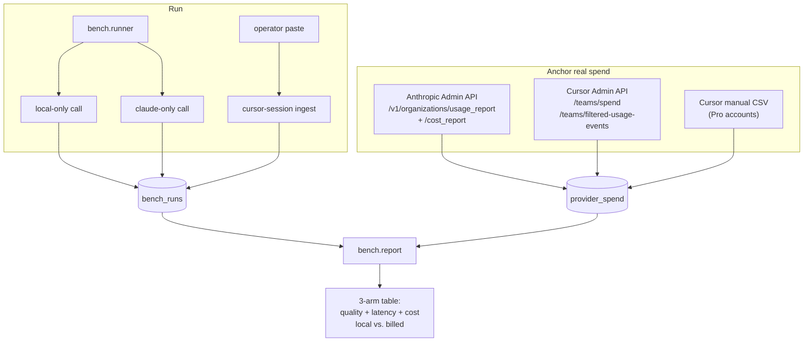

# Benchmarks: local vs. Claude vs. Cursor-without-proxy

This suite measures **quality, latency, and cost** of solving the same fairly
complex coding task three different ways:

| Arm                | What it is                                               | Path                                                      |
| ------------------ | -------------------------------------------------------- | --------------------------------------------------------- |
| `local-only`       | Pure local model via LiteLLM (`local-long` → Ollama Qwen3-Coder + TurboQuant) | Cursor → LiteLLM → Ollama (or direct API call)            |
| `claude-only`      | Pure Anthropic via LiteLLM (`claude-code` → Sonnet 4.6) | Cursor → LiteLLM → Anthropic API                          |
| `cursor-no-proxy`  | Cursor with `Override OpenAI Base URL` **disabled** — Cursor talks to its own backend, billed on your Cursor plan | Cursor → Cursor backend → (their model, their price)      |

Every arm produces a `bench_runs` row with the same fields (tokens, wall-clock,
TTFT, pytest pass/fail, composite score). Costs are captured **two ways**:

1. **Locally instrumented** (`actual_cost` / `shadow_cost`) — what we observe
   on the wire.
2. **Provider-billed** (`provider_spend.billed_usd`) — what Anthropic and
   Cursor *actually charged the user/key* during the run window, pulled from
   their authoritative APIs after the fact.

The comparison report shows both side-by-side so you can see drift between the
two (e.g. when Cursor adds its own token markup, or when Anthropic applies
prompt caching).

## At a glance



## The benchmark task

`bench/tasks/lru_ttl_cache.json` — implement a thread-safe LRU+TTL cache plus a
`@memoize` decorator in stdlib-only Python, with tight design constraints
(injectable time source, type hints, docstring rationale, statistics counters,
idempotent eviction, etc.). It is non-trivial: ~120 lines of correct code, ~30
distinct behaviors, several easy ways to ship a subtly broken implementation.

Grading is objective:

- The model's output is parsed for the first ```` ```python ```` fence.
- The extracted code is dropped into an isolated work dir with the grader test
  file (`bench/tasks/test_lru_ttl_cache.py`).
- Pytest runs it; we tally pass/fail.
- A few cheap AST checks (syntactic validity, module docstring word count,
  type-hint ratio, no-third-party-imports) feed a small composite score.

The grader test file defines the contract. Do **not** edit it to make a
particular model pass — write a different task instead.

## Running the benchmark

### One-shot (automated arms only)

```bash
make bench TASK=lru_ttl_cache ATTEMPTS=3
```

This runs `local-only` and `claude-only` end-to-end (model call + grading) and
prints the wall-clock window of each arm. Sample output:

```
=== local-only (local-long) ===
  att1: id=42 score=0.917 pytest=22/24 in=820 out=2104  actual=$0.0000  wall=27412ms gen=27188ms ttft=1180ms
  att2: id=43 score=0.917 pytest=22/24 in=820 out=2090  actual=$0.0000  wall=27015ms gen=26800ms ttft=1142ms
  att3: id=44 score=0.875 pytest=21/24 in=820 out=1990  actual=$0.0000  wall=26201ms gen=25988ms ttft=1108ms

=== claude-only (claude-code) ===
  att1: id=45 score=1.000 pytest=24/24 in=812 out=1620  actual=$0.0268  wall=8412ms  gen=8201ms  ttft=614ms
  ...

=== Provider-spend follow-up ===
  python -m bench.pull_spend --arm claude-only --task-id lru_ttl_cache \
      --window-start 1714000123 --window-end 1714000567 --providers anthropic
```

### Cursor arm (human-in-the-loop)

Cursor without our proxy doesn't expose its inference traffic, so we record
each session manually. The harness still grades the output and reconciles
spend afterwards.

1. **Disable the override** in Cursor: Settings → Models → uncheck *Override
   OpenAI Base URL*. (Or set `arm` to `cursor-hybrid` if you want to measure
   Cursor talking to LiteLLM instead.)
2. **Open a fresh Ask-mode chat.** Note the wall-clock start time.
3. **Paste the prompt** verbatim — copy it from the task spec:
   ```bash
   python3 -c 'import json; print(json.load(open("bench/tasks/lru_ttl_cache.json"))["prompt"])' | pbcopy
   ```
4. **Submit. Wait for completion. Note end time.** Optionally note the
   first-token timestamp from Cursor's request panel.
5. **Save the response and a session log:**
   ```bash
   mkdir -p bench/results/cursor-no-proxy-lru_ttl_cache-$(date +%s)
   cd $_
   pbpaste > output.txt        # or copy/paste the response into output.txt
   cat > session.json <<EOF
   {
     "arm": "cursor-no-proxy",
     "task_id": "lru_ttl_cache",
     "model": "claude-sonnet-4-6",
     "start_ts": 1714000200,
     "end_ts":   1714000287,
     "ttft_ms":  1300,
     "input_tokens":  4321,
     "output_tokens": 1840,
     "notes": "Ask mode, no rules, override OFF"
   }
   EOF
   cd -
   ```
6. **Ingest:**
   ```bash
   make bench-cursor \
       SESSION=bench/results/cursor-no-proxy-lru_ttl_cache-<ts>/session.json \
       OUTPUT=bench/results/cursor-no-proxy-lru_ttl_cache-<ts>/output.txt
   ```

Repeat 2–6 for `ATTEMPTS` runs. Use sequential timestamps so the windows don't
overlap with the LiteLLM arms (otherwise Anthropic admin spend will be
attributed to whichever arm asks for the snapshot first).

### Anchor provider-billed spend

After all arms have run for a task, snapshot the provider's actual billing for
each arm's wall-clock window:

```bash
# Claude tier - hit the Anthropic Admin Usage & Cost API
export ANTHROPIC_ADMIN_API_KEY=sk-ant-admin-...      # NOT the regular API key
# optional: scope to the keys we used so other org traffic isn't attributed
export ANTHROPIC_API_KEY_IDS=apikey_xxx,apikey_yyy
make bench-pull-spend ARM=claude-only \
    START=1714000123 END=1714000567 \
    PROVIDERS=anthropic TASK=lru_ttl_cache

# Cursor arms - hit the Cursor Admin API (Teams/Enterprise plans)
export CURSOR_ADMIN_API_KEY=cur-team-...
# optional: scope to the operator's email so other team traffic is excluded
export CURSOR_USER_EMAILS=you@yourco.com
make bench-pull-spend ARM=cursor-no-proxy \
    START=1714000200 END=1714000287 \
    PROVIDERS=cursor TASK=lru_ttl_cache
```

If you're on a Cursor Pro / Pro+ individual plan (no team admin API), export
your usage CSV from cursor.com/dashboard → Billing & Invoices, then:

```bash
export CURSOR_MANUAL_SPEND_CSV=$HOME/Downloads/cursor-usage.csv
make bench-pull-spend ARM=cursor-no-proxy \
    START=... END=... PROVIDERS=cursor TASK=lru_ttl_cache
```

The CSV must have columns (case-insensitive): `timestamp, model, input_tokens,
output_tokens, cache_read_tokens, cache_write_tokens, charged_usd`.

### Read the report

```bash
make bench-report TASK=lru_ttl_cache
```

```
=== Bench: lru_ttl_cache  (9 runs across 3 arms) ===

  arm                n  pass% score  wall_ms   gen_ms  ttft_ms     in_tok    out_tok   actual$     billed$ (provider)   Δ vs cheapest
  ----------------------------------------------------------------------------------------------------------------------------------
  local-only         3   33%  0.91    27015    26800     1142        820       2090   $0.0000   $0.0000 (none)             baseline
  claude-only        3  100%  0.99     8412     8201      614        812       1620   $0.0268   $0.0265 (admin-api-cost)   +$0.0265 / +inf%
  cursor-no-proxy    3  100%  0.97    11800    11800     1300       4321       1840   $0.0000   $0.0594 (usage-events)     +$0.0594 / +inf%
```

### Cost reconciliation columns explained

- **`actual$`**  — what *we* observed on the wire, scoring at Anthropic's
  rate card. For `local-only` this is always `$0`. For `claude-only` it's
  computed from the LiteLLM-reported token counts. For `cursor-no-proxy` it's
  always `$0` because we can't see the wire.
- **`billed$ (provider)`** — what the provider's billing system actually
  charged for the run window, with the data source labeled. Sources:
  - `admin-api-cost`: Anthropic `/v1/organizations/cost_report` (USD).
  - `admin-api`: Anthropic `/v1/organizations/usage_report/messages` (tokens
    only — used to verify our local instrumentation is accurate).
  - `usage-events`: Cursor `/teams/filtered-usage-events` summed by
    `chargedCents`. Best granularity, matches the dashboard.
  - `usage-events-rollup`: same data, rolled up across models.
  - `manual-csv`: a CSV exported from the Cursor dashboard.
- **`Δ vs cheapest`** — uses `billed$` if anchored, otherwise falls back to
  `actual$`. Lets you eyeball "running on Cursor cost me 2.2× what running
  through our LiteLLM proxy did" at a glance.

## Why the report has both `actual$` and `billed$`

They diverge for several real reasons:

| Reason                              | Affects which arm                                |
| ----------------------------------- | ------------------------------------------------ |
| Cursor's per-token markup           | `cursor-no-proxy`, `cursor-hybrid`               |
| Anthropic prompt caching discount   | `claude-only`                                    |
| Different tokenizer than LiteLLM    | `claude-only`                                    |
| Plan-level included usage / credits | `cursor-no-proxy`                                |
| Aggregation lag at provider         | all (snapshot the window 5–15 min after the run) |

The local instrumentation gives you the answer **immediately** (so the iter
loop is fast). The provider snapshot gives you the answer **for accounting**
(so the savings claim is defensible).

## Setting up credentials

### Anthropic admin API key

The regular `ANTHROPIC_API_KEY` (used by LiteLLM for the actual model calls)
will **not** work for the Usage & Cost API. You need a separate *Admin* key:

1. Open https://console.anthropic.com → Settings → **Admin API Keys**
2. *Create Key*. Format will be `sk-ant-admin-...`.
3. Export it locally:
   ```bash
   export ANTHROPIC_ADMIN_API_KEY=sk-ant-admin-xxxxxxxxxxxx
   ```
4. (Optional) Find the API key IDs you actually used for the benchmark
   (Console → API Keys → click → copy ID, format `apikey_...`) and pin
   the collector to them so other org traffic isn't included:
   ```bash
   export ANTHROPIC_API_KEY_IDS=apikey_aaa,apikey_bbb
   ```

### Cursor team admin API key

Available on **Teams** and **Enterprise** plans only.

1. cursor.com/dashboard → **Team** → **API Keys** → *Create*
2. Copy the key. Cursor uses HTTP Basic with the key as the username and an
   empty password (the collector handles this for you).
3. Export it:
   ```bash
   export CURSOR_ADMIN_API_KEY=cur-team-xxxxxxxxxxxx
   ```
4. (Optional) Scope to specific team members:
   ```bash
   export CURSOR_USER_EMAILS=you@yourco.com,teammate@yourco.com
   ```

### Cursor Pro / Pro+ (no admin API)

Individual plans don't have programmatic billing access. The collector falls
back to a CSV exported from the dashboard:

1. cursor.com/dashboard → Billing & Invoices → *Export usage CSV*
2. ```bash
   export CURSOR_MANUAL_SPEND_CSV=/path/to/cursor-usage.csv
   ```
   Setting this env var bypasses the admin API for the Cursor collector.

## Running statistically meaningful comparisons

A single attempt is noisy. Defaults:

| What we control                | Recommended                                          |
| ------------------------------ | ---------------------------------------------------- |
| Attempts per arm per task      | ≥ 3 (the report uses median for latency, mean for score) |
| Temperature                    | 0.2 (set in the runner; same for all arms)          |
| Cursor mode                    | Ask mode only — Agent mode adds tool-call overhead   |
| Network conditions             | Run all three arms back-to-back, same Wi-Fi          |
| Time of day                    | Anthropic's API has measurable load-based variance   |
| Local model warmup             | Run one throw-away `make bench-local` before timing  |

For a publishable comparison, run **three tasks × three attempts × three
arms** (27 runs ≈ 30 min if local is fast, more if Cursor sessions are
recorded by hand). The report aggregates within `(task, arm)` so you can
average across tasks afterwards.

## Adding a new task

1. Drop `bench/tasks/<task_id>.json` with `id`, `prompt`, and `grading`
   (`save_as`, `test_file`, `weights`).
2. Drop `bench/tasks/<test_file>.py` — pytest tests that grade the model's
   output. Tests must `import <save_as without .py>` so the harness's work
   dir layout works.
3. `make bench TASK=<task_id>`.

The grader allows imports from this stdlib subset only:

```
collections, threading, time, functools, typing, dataclasses, weakref,
heapq, math, operator, __future__, abc, sys
```

If your task needs more, edit `_no_third_party_imports`'s allowlist in
`bench/grader.py` and the matching `test_no_third_party_imports` test in the
task's grader file.

## Caveats

- **Cursor Agent mode** ignores custom OpenAI keys today. The benchmark uses
  Ask mode for all Cursor arms; this matches what most users actually do for
  generative coding tasks but not what they do for repo-scale refactors.
- **Cursor's `chargedCents` is post-discount**. If your plan has included
  usage you haven't blown through yet, the per-event amount will be 0 even
  though the *value* of the call (its rate-card cost) is non-zero. To see
  rate-card cost, sum `tokenUsage.totalCents` instead of `chargedCents`. The
  collector preserves both in the raw blob.
- **Anthropic cost data lags ~5–15 min**. Don't pull spend immediately after
  a run; either sleep 15 minutes or pull on a daily schedule and reconcile
  later.
- **Provider snapshots are window-overlap, not window-equality.** A daily
  cost bucket from `2026-04-27T00:00:00Z` to `2026-04-28T00:00:00Z` will be
  attributed to *every* arm whose run window falls inside that day. To
  attribute precisely, scope by `api_key_id` (Anthropic) or `userEmails`
  (Cursor) so each arm uses a different key/user.
- **`cursor-hybrid` arm** (Cursor with the LiteLLM override pointing at our
  proxy) will appear in `bench_runs` and `cost.requests` because the proxy
  callbacks fire normally. It's mostly there to verify that your Cursor wiring
  matches `local-only` / `claude-only` end-to-end.
